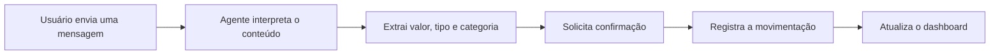
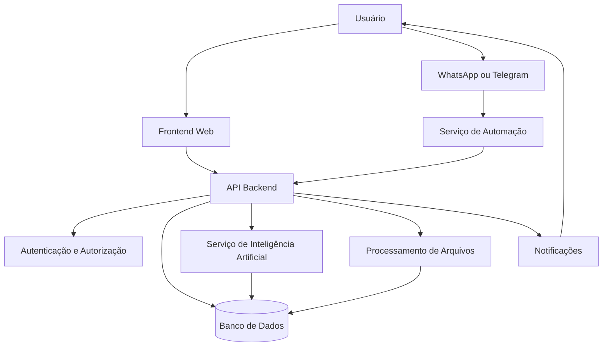
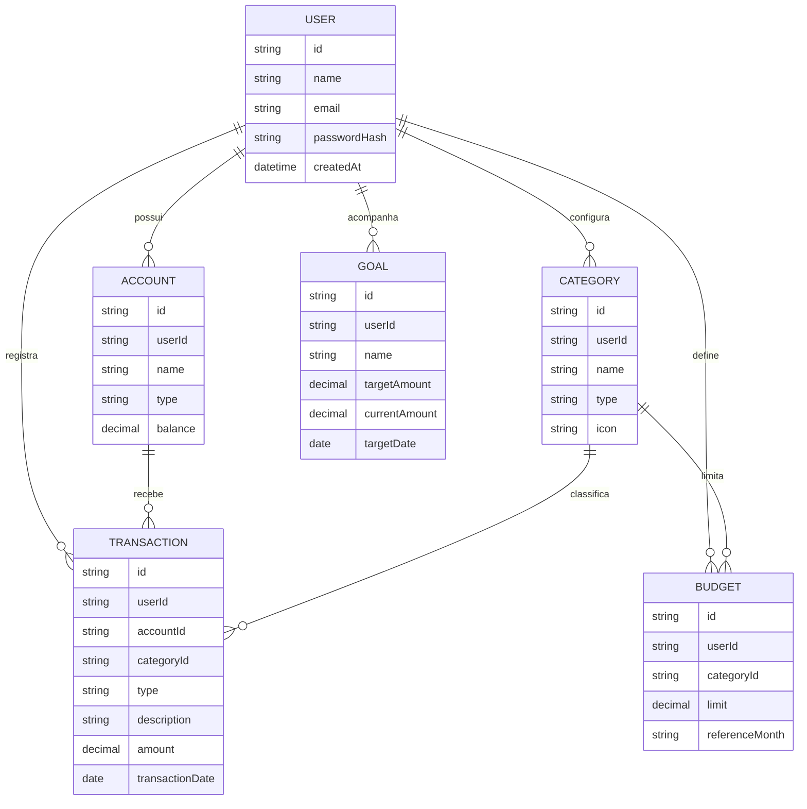

<div align="center">


<a href="https://git.io/typing-svg">
  
</a>

<br>


<br><br>

<a href="#">
  
</a>
<a href="#">
  
</a>
<a href="#">
  
</a>

<br><br>


</div>

---

## ✦ Sobre o Nexo Finance

O **Nexo Finance** é uma plataforma de gestão financeira criada para ajudar pessoas a entenderem melhor sua vida financeira, organizarem movimentações e tomarem decisões com mais clareza.

O projeto busca substituir controles fragmentados em planilhas, anotações e aplicativos complexos por uma experiência centralizada, moderna e fácil de utilizar.

Por meio de dashboards, categorização de movimentações, acompanhamento de metas e automações, o Nexo Finance transforma dados financeiros em informações visuais e úteis para o dia a dia.

> O objetivo não é apenas registrar despesas, mas criar uma conexão real entre movimentações, hábitos, objetivos e decisões financeiras.

---

## ✦ O problema

Muitas pessoas sabem quanto recebem, mas não conseguem identificar com clareza:

- Para onde o dinheiro está indo.
- Quanto podem gastar sem comprometer o orçamento.
- Quais categorias consomem a maior parte da renda.
- Quanto falta para atingir uma meta.
- Quais despesas estão aumentando.
- Como estará sua situação financeira nos próximos meses.

Aplicativos tradicionais frequentemente apresentam excesso de informações, interfaces confusas ou dependem de processos manuais demorados.

O Nexo Finance nasce para tornar esse acompanhamento mais simples, visual e acessível.

---

## ✦ A solução

A plataforma centraliza as principais informações financeiras do usuário em um único ambiente.

<div align="center">

| Recurso | Benefício |
| :--- | :--- |
| **Dashboard financeiro** | Visão rápida do saldo, receitas, despesas e comportamento financeiro. |
| **Registro de movimentações** | Organização de entradas e saídas com categorias e descrições. |
| **Metas financeiras** | Acompanhamento do progresso de objetivos pessoais. |
| **Orçamentos por categoria** | Definição de limites mensais para controlar gastos. |
| **Relatórios e indicadores** | Identificação de padrões e evolução financeira. |
| **Automações** | Redução do trabalho manual no registro de transações. |
| **Inteligência Artificial** | Interpretação de movimentações e geração de análises personalizadas. |

</div>

---

## ✦ Principais funcionalidades

### Dashboard geral

Visualização consolidada da situação financeira do usuário.

- Saldo atual.
- Total de receitas.
- Total de despesas.
- Resultado do período.
- Comparativo mensal.
- Gráficos por categoria.
- Evolução do saldo.
- Últimas movimentações.

### Receitas e despesas

Gerenciamento completo das movimentações financeiras.

- Cadastro de receitas e despesas.
- Categorização das transações.
- Movimentações recorrentes.
- Filtros por período, tipo e categoria.
- Edição e exclusão de registros.
- Busca por descrição.
- Identificação da forma de pagamento.

### Categorias personalizadas

O usuário poderá organizar suas movimentações de acordo com sua realidade.

Exemplos:

- Alimentação.
- Moradia.
- Transporte.
- Saúde.
- Educação.
- Lazer.
- Assinaturas.
- Salário.
- Freelance.
- Investimentos.

### Orçamento mensal

Definição de limites de gastos para cada categoria.

A plataforma poderá informar:

- Percentual utilizado.
- Valor disponível.
- Categorias próximas do limite.
- Categorias que ultrapassaram o orçamento.
- Comparação com meses anteriores.

### Metas financeiras

Criação e acompanhamento de objetivos financeiros.

Exemplos:

- Reserva de emergência.
- Compra de um veículo.
- Viagem.
- Pagamento de dívidas.
- Investimento.
- Compra de equipamentos.
- Entrada de imóvel.

### Relatórios e análises

Geração de indicadores para apoiar decisões financeiras.

- Gastos por categoria.
- Receitas por origem.
- Evolução mensal.
- Comparação entre períodos.
- Média de despesas.
- Taxa de economia.
- Maiores movimentações.
- Projeções financeiras.

---

## ✦ Inteligência Artificial

O Nexo Finance está sendo projetado para utilizar Inteligência Artificial como uma ferramenta de apoio, simplificando tarefas e oferecendo análises mais acessíveis.

### Recursos planejados

| Recurso com IA | Descrição |
| :--- | :--- |
| **Categorização automática** | Identificação da categoria mais adequada para cada movimentação. |
| **Registro por linguagem natural** | Cadastro de transações a partir de mensagens simples. |
| **Análise de hábitos** | Identificação de padrões de consumo e mudanças no comportamento financeiro. |
| **Resumo financeiro** | Geração de explicações sobre receitas, gastos e evolução mensal. |
| **Alertas inteligentes** | Avisos sobre gastos incomuns, limites e possíveis riscos no orçamento. |
| **Consultas conversacionais** | Perguntas sobre os próprios dados financeiros em linguagem natural. |
| **Sugestões personalizadas** | Recomendações baseadas no histórico e nos objetivos cadastrados. |

### Exemplos de comandos planejados

```text
Gastei R$ 48,90 no supermercado.

Recebi R$ 1.200 de um projeto freelance.

Quanto gastei com alimentação neste mês?

Quais despesas aumentaram em comparação com o mês passado?

Quanto preciso guardar por mês para atingir minha meta?

Faça um resumo da minha situação financeira atual.
```

---

## ✦ Integrações planejadas

O Nexo Finance poderá receber dados de diferentes canais, reduzindo a necessidade de acessar o sistema para registrar cada movimentação.

<div align="center">


</div>

<br>

### WhatsApp e Telegram

Exemplo de fluxo:



### Importação de extratos

Possibilidade de importar movimentações por meio de:

- Arquivos CSV.
- Planilhas.
- Extratos em PDF.
- Dados exportados por instituições financeiras.
- Integrações futuras com serviços bancários autorizados.

---

## ✦ Experiência do usuário

A interface do Nexo Finance segue uma proposta visual moderna, profissional e orientada à clareza.

### Direção visual

- Tema predominantemente escuro.
- Contraste entre preto, cinza e verde.
- Indicadores de receitas em verde.
- Indicadores de despesas em vermelho.
- Alertas em amarelo ou laranja.
- Cards com informações objetivas.
- Gráficos responsivos.
- Navegação simples.
- Experiência adaptada para computadores e dispositivos móveis.

### Estrutura planejada

```text
Nexo Finance
│
├── Dashboard
├── Movimentações
│   ├── Receitas
│   ├── Despesas
│   └── Recorrências
│
├── Contas
├── Cartões
├── Categorias
├── Orçamentos
├── Metas
├── Relatórios
├── Assistente com IA
├── Integrações
└── Configurações
```

---

## ✦ Tecnologias

<div align="center">

### Frontend

<a href="#">
  
</a>

<br><br>

### Backend

<a href="#">
  
</a>

<br><br>

### Banco de dados

<a href="#">
  
</a>

<br><br>

### Infraestrutura e ferramentas

<a href="#">
  
</a>

<br><br>


</div>

> A stack poderá sofrer alterações durante o desenvolvimento conforme as necessidades técnicas do projeto.

---

## ✦ Arquitetura planejada



### Componentes

| Componente | Responsabilidade |
| :--- | :--- |
| **Frontend** | Interface, dashboards, formulários e experiência do usuário. |
| **API Backend** | Regras de negócio, autenticação, movimentações e integrações. |
| **Banco de dados** | Armazenamento de usuários, contas, categorias, metas e transações. |
| **Serviço de IA** | Interpretação de mensagens, classificação e geração de análises. |
| **Automação** | Integração com WhatsApp, Telegram, planilhas e serviços externos. |
| **Processamento de arquivos** | Importação e interpretação de extratos e documentos financeiros. |

---

## ✦ Modelo inicial de dados



---

## ✦ Segurança e privacidade

Como a plataforma trabalha com informações financeiras, segurança e privacidade são partes essenciais do projeto.

### Práticas planejadas

- Criptografia de dados sensíveis.
- Senhas armazenadas com hash seguro.
- Autenticação baseada em tokens.
- Controle de acesso por usuário.
- Validação de dados no frontend e backend.
- Proteção contra requisições indevidas.
- Limitação de tentativas de acesso.
- Logs de ações importantes.
- Backups periódicos.
- Exclusão de conta e dados.
- Política de privacidade transparente.
- Adequação às boas práticas da LGPD.

> O Nexo Finance não deve solicitar senhas bancárias nem credenciais de acesso direto às contas dos usuários.

---

## ✦ Diferenciais do projeto

<div align="center">

| Diferencial | Descrição |
| :--- | :--- |
| **Experiência simplificada** | Informações financeiras apresentadas de forma clara e objetiva. |
| **Registro por mensagens** | Possibilidade de registrar movimentações usando linguagem natural. |
| **Inteligência Artificial aplicada** | IA utilizada para organizar, explicar e analisar dados financeiros. |
| **Automação multicanal** | Integração planejada com WhatsApp, Telegram, arquivos e planilhas. |
| **Foco em decisões** | O sistema busca mostrar o que os dados significam, não apenas armazená-los. |
| **Produto em evolução** | Arquitetura preparada para receber novos módulos e integrações. |

</div>

---

## ✦ Roadmap

### Fase 1 — Estrutura inicial

- [x] Definição do conceito do produto.
- [x] Definição da identidade Nexo Finance.
- [x] Planejamento das principais funcionalidades.
- [ ] Estrutura inicial do frontend.
- [ ] Estrutura inicial do backend.
- [ ] Configuração do banco de dados.
- [ ] Autenticação de usuários.

### Fase 2 — MVP financeiro

- [ ] Dashboard principal.
- [ ] Cadastro de receitas.
- [ ] Cadastro de despesas.
- [ ] Categorias personalizadas.
- [ ] Contas e saldos.
- [ ] Filtros e pesquisas.
- [ ] Relatórios básicos.
- [ ] Design responsivo.

### Fase 3 — Planejamento financeiro

- [ ] Orçamentos por categoria.
- [ ] Metas financeiras.
- [ ] Movimentações recorrentes.
- [ ] Alertas de limite.
- [ ] Comparativo mensal.
- [ ] Projeção de saldo.

### Fase 4 — Automações

- [ ] Integração com WhatsApp.
- [ ] Integração com Telegram.
- [ ] Registro por mensagem.
- [ ] Importação de arquivos CSV.
- [ ] Integração com Google Sheets.
- [ ] Notificações automatizadas.

### Fase 5 — Inteligência Artificial

- [ ] Categorização automática.
- [ ] Assistente financeiro conversacional.
- [ ] Resumo mensal inteligente.
- [ ] Detecção de gastos incomuns.
- [ ] Sugestões personalizadas.
- [ ] Análise de hábitos financeiros.

### Fase 6 — Evolução do SaaS

- [ ] Sistema de planos.
- [ ] Assinaturas e pagamentos.
- [ ] Painel administrativo.
- [ ] Gestão de usuários.
- [ ] Monitoramento e logs.
- [ ] Aplicativo móvel ou PWA.
- [ ] Integrações financeiras autorizadas.

---

## ✦ Situação atual

```yaml
projeto:
  nome: "Nexo Finance"
  categoria: "SaaS de gestão financeira"
  status: "Em desenvolvimento"
  plataforma: "Aplicação web responsiva"

objetivo:
  - "Simplificar o controle financeiro pessoal"
  - "Centralizar receitas, despesas, metas e orçamentos"
  - "Transformar dados financeiros em informações úteis"
  - "Automatizar tarefas repetitivas"
  - "Aplicar inteligência artificial de forma prática"

desenvolvendo:
  - "Experiência visual do dashboard"
  - "Estrutura das movimentações financeiras"
  - "Organização dos módulos da aplicação"
  - "Planejamento das integrações"
  - "Definição da arquitetura do sistema"

planejado:
  - "Integração com WhatsApp e Telegram"
  - "Importação de extratos"
  - "Assistente financeiro com IA"
  - "Relatórios e projeções"
  - "Versão SaaS com planos de assinatura"
```

---

## ✦ Instalação local

### Pré-requisitos

Antes de iniciar, instale:

- Node.js.
- npm, pnpm ou yarn.
- Git.
- Banco de dados utilizado no projeto.

### Clone o repositório

```bash
git clone https://github.com/Cesare221/NOME-DO-REPOSITORIO.git
```

### Entre na pasta do projeto

```bash
cd NOME-DO-REPOSITORIO
```

### Instale as dependências

```bash
npm install
```

### Configure as variáveis de ambiente

Crie um arquivo `.env` com base no `.env.example`.

```env
DATABASE_URL=
JWT_SECRET=
NEXT_PUBLIC_API_URL=
AI_API_KEY=
EVOLUTION_API_URL=
EVOLUTION_API_KEY=
```

### Execute o projeto

```bash
npm run dev
```

A aplicação estará disponível no endereço indicado pelo terminal.

---

## ✦ Scripts

```bash
npm run dev
```

Executa o projeto em ambiente de desenvolvimento.

```bash
npm run build
```

Gera a versão de produção.

```bash
npm run start
```

Executa a versão de produção.

```bash
npm run lint
```

Analisa a qualidade e a padronização do código.

```bash
npm run test
```

Executa os testes automatizados, quando configurados.

---

## ✦ Estrutura sugerida do projeto

```text
nexo-finance/
│
├── src/
│   ├── app/
│   ├── components/
│   ├── features/
│   │   ├── accounts/
│   │   ├── budgets/
│   │   ├── categories/
│   │   ├── goals/
│   │   ├── reports/
│   │   └── transactions/
│   │
│   ├── hooks/
│   ├── lib/
│   ├── services/
│   ├── styles/
│   ├── types/
│   └── utils/
│
├── public/
├── tests/
├── .env.example
├── package.json
└── README.md
```

---

## ✦ Contribuição

O Nexo Finance está em desenvolvimento e contribuições poderão ser aceitas conforme a evolução do projeto.

### Processo sugerido

1. Faça um fork do repositório.
2. Crie uma branch para a alteração.

```bash
git checkout -b feature/nome-da-funcionalidade
```

3. Realize as alterações.
4. Execute os testes e verificações.
5. Crie um commit descritivo.

```bash
git commit -m "feat: adiciona nova funcionalidade"
```

6. Envie a branch.

```bash
git push origin feature/nome-da-funcionalidade
```

7. Abra um Pull Request.

---

## ✦ Autor

<div align="center">

### Cesar Delmondes

Desenvolvedor Full Stack focado em sistemas SaaS, automações, integrações e soluções com Inteligência Artificial.

<br>

<a href="https://github.com/Cesare221">
  
</a>

<a href="#">
  
</a>

<a href="mailto:SEU-EMAIL">
  
</a>

</div>

---

## ✦ Licença

Este projeto é de propriedade de **Cesar Delmondes**.

O código não poderá ser copiado, distribuído, comercializado ou utilizado em outros projetos sem autorização prévia, salvo quando uma licença específica for adicionada ao repositório.

---

<div align="center">

### Nexo Finance

**Conectando seus dados às suas decisões.**

<br>


</div>
